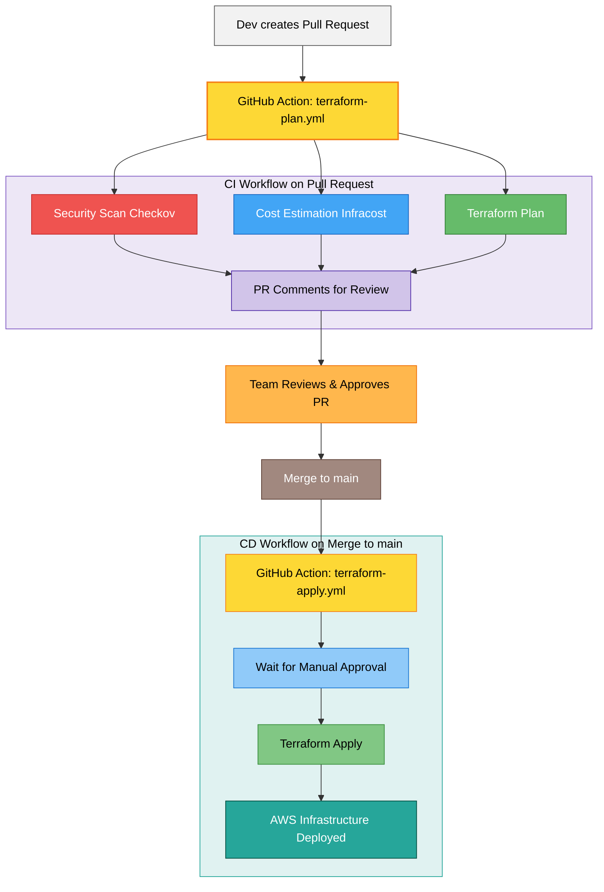

# Secure & Cost-Aware AWS CI/CD Pipeline with Terraform

A professional-grade, end-to-end CI/CD pipeline for deploying AWS infrastructure with built-in security, cost estimation, and governance controls.


[](https://github.com/githubabhay2003/terraform-aws-cicd/actions/workflows/terraform-apply.yml)

---

## 🚀 Overview

This project demonstrates a fully automated CI/CD pipeline for provisioning, validating, and deploying AWS infrastructure managed with Terraform.

**This project solves the real-world challenge of deploying infrastructure changes safely, securely, and with full cost visibility.** It moves beyond a simple `terraform apply` by integrating "shift-left" principles, embedding security scanning, cost estimation, and manual approval gates directly into the GitOps workflow.

### 🎥 Demo

Here is a short video demonstrating the full CI/CD pipeline in action, from pull request to deployment.


https://github.com/user-attachments/assets/5f20f343-942a-44f0-bed6-c2062b536e55


---

## ⚙️ Architecture & Features

This pipeline is built on a GitOps-centric workflow that triggers two distinct GitHub Actions: one for **Pull Requests** (CI) and one for **Merges to `main`** (CD).


## Key Features

- **Secure OIDC Authentication**: Uses GitHub's OIDC provider to authenticate with AWS via a short-lived IAM Role. No static `AWS_ACCESS_KEY_ID` secrets are required.
- **"Shift-Left" Security**: On every PR, a Checkov scan runs against the Terraform code, uploading any vulnerabilities as SARIF alerts directly to the **Security** tab.
- **Cost Estimation (FinOps)**: On every PR, Infracost runs and posts a comment detailing the estimated monthly cost increase or decrease of the proposed changes.
- **Automated Plan Review**: On every PR, a Terraform plan is generated and posted as a comment, providing a clean execution plan for reviewers.
- **Manual Approval Gate**: Uses GitHub Environments to protect the main branch. A deployment to production requires manual approval from a designated reviewer, preventing accidental applies.
- **Automated Deployment (CD)**: Once approved, the Terraform apply job runs automatically, deploying the infrastructure changes to AWS.
- **Remote State Management**: Utilizes AWS S3 for persistent state storage and DynamoDB for state locking to ensure safe, concurrent operations.

## 📂 Repository Structure

```plaintext
terraform-aws-cicd/
├── .github/
│   └── workflows/
│       ├── terraform-plan.yml  # (CI) Runs checks on Pull Requests
│       └── terraform-apply.yml # (CD) Deploys on merge to main
├── .gitignore
├── backend.tf                  # Configures S3/DynamoDB remote state
├── main.tf                     # Main Terraform code for AWS resources
└── README.md                   # This file
```
## Tech Stack

| Tool | Purpose |
| :--- | :--- |
| **Terraform** | Infrastructure as Code |
| **AWS** | Cloud Provider |
| **GitHub Actions** | CI/CD Automation |
| **GitHub OIDC** | Secure, keyless authentication to AWS |
| **Checkov** | Static Analysis Security Testing (SAST) for IaC |
| **Infracost** | FinOps & Cost Estimation |
| **S3 / DynamoDB** | Terraform Remote State & Locking |
| **Git / GitHub** | Version Control & GitOps |

---

## Setup Instructions (How to Run)

To replicate this project, you will need an AWS account and a GitHub account.

### 1. Fork the Repository

Fork this repo to your own GitHub account.

### 2. AWS Backend Setup

* **S3:** Manually create an S3 bucket with versioning enabled.
* **DynamoDB:** Manually create a DynamoDB table with a partition key named `LockID`.
* Update `backend.tf` with your new bucket name and table name.

### 3. AWS OIDC & IAM Setup

1.  In the AWS IAM console, add **GitHub** as an Identity Provider (OIDC).
2.  Create a new IAM Role that trusts the GitHub OIDC provider (e.g., `token.actions.githubusercontent.com`).
3.  Attach an administrative policy (or a more granular policy) to this role.
4.  Copy the **ARN** of this new role.

### 4. GitHub Secrets & Environments

1.  Go to your forked repo's **Settings > Secrets and variables > Actions**.
2.  Add a new repository secret:
    * `AWS_ROLE_TO_ASSUME`: The ARN of the IAM role you just created.
3.  Get a free Infracost API key by running `infracost register` locally.
4.  Add a second repository secret:
    * `INFRACOST_API_KEY`: Your Infracost API key.
5.  Go to **Settings > Environments** and create a new environment named `production`.
6.  Add a protection rule, select **Required reviewers**, and add your GitHub username.

### 5. Run the Pipeline

1.  Create a new branch:
    ```bash
    git checkout -b feat-test
    ```
2.  Make a small change to `main.tf` (e.g., add an `aws_instance`).
3.  Push the branch and open a Pull Request.
4.  Observe the `plan-and-cost` and `checkov-scan` jobs run.
5.  Merge the PR, navigate to the **Actions** tab, and approve the deployment to see it apply.
## 📸 Usage Examples & Screenshots

The pipeline provides rich, automated feedback directly in the Pull Request:

1. **Security Scan Results**  
   Checkov flags vulnerabilities directly on the "Files changed" tab.


2. **Cost Estimation Report**  
   Infracost posts a detailed cost breakdown as a comment.


3. **Terraform Plan Output**  
   A clean plan output is posted for easy review.


4. **Manual Approval Gate**


## 🤝 Contributing

Contributions are welcome! Please open an issue to discuss your ideas or submit a pull request with your changes.

## 📄 License

This project is licensed under the MIT License - see the LICENSE file for details.  


## 👨‍💻 Author

**Abhay Kumar Saini**  

- GitHub: [@githubabhay2003](https://github.com/githubabhay2003)  
- LinkedIn: [https://www.linkedin.com/in/abhay-kumar-saini-571891264/](https://www.linkedin.com/in/https://www.linkedin.com/in/abhay-kumar-saini-571891264/)
