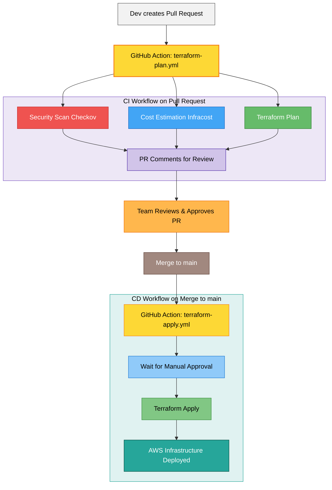

# Secure & Cost-Aware AWS CI/CD Pipeline with Terraform

A professional-grade, end-to-end CI/CD pipeline for deploying AWS infrastructure with built-in security, cost estimation, and governance controls.

---

## 🚀 Overview

This project demonstrates a fully automated CI/CD pipeline for provisioning, validating, and deploying AWS infrastructure managed with Terraform.

**This project solves the real-world challenge of deploying infrastructure changes safely, securely, and with full cost visibility.** It moves beyond a simple `terraform apply` by integrating "shift-left" principles, embedding security scanning, cost estimation, and manual approval gates directly into the GitOps workflow.

### 🎥 Demo

Here is a short video demonstrating the full CI/CD pipeline in action, from pull request to deployment.

`[Link to Your Demo Video or GIF]`

---

## ⚙️ Architecture & Features

This pipeline is built on a GitOps-centric workflow that triggers two distinct GitHub Actions: one for **Pull Requests** (CI) and one for **Merges to `main`** (CD).

